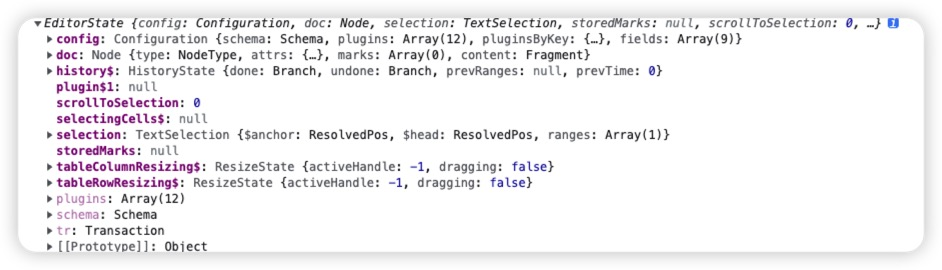

# prosemirror-tabls 源码解读

## 名次解释

> PS: 理解完概念再往下看，不然你会一脸懵

### [document](https://prosemirror.net/docs/guide/#doc)

用于表示`ProseMirror`的整个文档，使用`editor.view.state.doc`引用，`ProseMirror`定义自己的数据结构来存储`document`内容，通过输出可以看到`document`是一个`Node`类型，包含`content`元素，是一个[fragment](https://prosemirror.xheldon.com/docs/ref/#model.Fragment)对象，而每个`fragment`又包含 0
个或多个字节点，组成了`document`解构，类似于`DOM`树

.

### [Schema](https://prosemirror.net/docs/guide/#schema)

用于定义文档的结构和内容。它定义了一组节点类型和它们的属性，例如段落、标题、链接、图片等等。Schema 是编辑器的模型层，可以通过其 API 创建、操作和验证文档中的节点。每个`document`都有一个与之相关的`schema`，用于描述存在于此`document`中的`nodes`类型

### [Node](https://prosemirror.net/docs/ref/#model.Node)

文档中的节点,节点是 `Schema` 中定义的类型之一，一个文档就是一个`Node`实例，它的每个字节点，例如一个段落、一个列表项、一张图片都是`Node`的实例。`Node`的修改遵循`Immutable`原则

### [Mark](https://prosemirror.net/docs/ref/#model.Mark)

`Prosemirror` 将行内文本视作扁平结构而非 DOM 类似的树状结构说是为了方便计数和操作，用于给节点添加样式、属性或其他信息的一种方式。例如，一个文本节点可以添加加粗、斜体、下划线等样式，也可以添加标签、链接等属性。`Mark` 本身没有节点结构，只是对一个节点的文本内容进行修饰。`Marks`通过`Schema`创建，用于控制哪些`marks`存在于哪些节点以及用于哪些`attributes`。

### [State](https://prosemirror.net/docs/guide/#state)

`Prosemirror` 的数据结构对象, 相当于是 `react` 的 `state`, 有 `view` 的 `state` 和 `plugin` 的局部 `state` 之分. 如上面的 `schema` 就定义在其上: `state.schema`。`ProseMirror` 使用一个单独的大对象来保持对编辑器所有 `state` 的引用（基本上来说，需要创建一个与当前编辑器相同的编辑器）



### [Transaction](https://prosemirror.net/docs/guide/)

继承自[Transform](https://prosemirror.net/docs/guide/#transform)，不仅能追踪对文档进行修改的一组操作，还能追踪`state`的其他变化，例如选区更新等。每次更新都会产生一个新的`state.transactions`（通过`state.tr`来创建一个`transaction`实例），描述当前`state`被应用的变化，这些变化用来应用当前`state`来创建一个更新之后的`state`，然后这个新的`state`被用来更新`view`。

> 此处的 state 指的是 EditorState，描述编辑器的状态，包含了文档的内容、选区、当前的节点和标记集合等信息。每次编辑器发生改变时，都会生成一个新的 EditorState。

### [View](https://prosemirror.net/docs/guide/#view)

`ProseMirror`编辑器的视图层，负责渲染文档内容和处理用户的输入事件。`View` 接受来自 `EditorState` 的更新并将其渲染到屏幕上。同时，它也负责处理来自用户的输入事件，如键盘输入、鼠标点击等。其中`state`就是其上的一个属性：`view.state`

新建编辑器第一步就是`new`一个`EditorVIew`

### [Plugin](https://prosemirror.net/docs/ref/#state.Plugin_System)

`ProseMirror` 中的插件，用于扩展编辑器的功能，例如点击/粘贴/撤销等。每个插件都是一个包含了一组方法的对象，这些方法可以监听编辑器的事件、修改事务、渲染视图等等。每个插件都包含一个`key`属性，如`prosemirror-tables`设置`key`为`tableColumnResizing`，通过这个`key`就可以访问插件的配置和状态，而无需访问插件实例对象。

```js
const pluginState = columnResizingPluginKey.getState(state);
```

### [Commands](https://prosemirror.net/docs/guide/#commands)

表示`Command`函数集合，每个`command`函数定义一些触发事件来执行各种操作。

### [Decorations](https://www.xheldon.com/tech/prosemirror-guide-chinese.html?mode=light#decorations)

表示节点的外观和行为的对象。它可以用于添加样式、标记、工具提示等效果，以及处理点击、悬停、拖拽等事件。Decoration 通常是在渲染视图时应用到节点上的，但也可以在其他情况下使用，如在协同编辑时标记其他用户的光标位置。

用于绘制`document view`，通过`decorations`属性的返回值来创建，包含三种类型

- Node decorations: 增加样式或其他 `DOM` 属性到单个 node 的 `DOM` 上，如选中表格时增加的类名
- Widget decorations: 在给定位置插入 `DOM node`，并不是实际文档的一部分，如表格拖拽时增加的基线
- Inline decoration: 在给定的 `range` 中的行内杨素插入样式或属性，类似于 `Node decorations`，仅针对行内元素

`prosemirror` 为了快速绘制这些类型，通过 `decorationSet.create` 静态方法来创建

```js
import { Plugin, PluginKey } from 'prosemirror-state';
let purplePlugin = new Plugin({
  props: {
    decorations(state) {
      return DecorationSet.create(state.doc, [
        Decoration.inline(0, state.doc.content.size, {
          style: 'color: purple',
        }),
      ]);
    },
  },
});
```

### [Selection](https://prosemirror.net/docs/ref/#state.Selection)

表示当前选中内容，`prosemirror`中默认定义两种类型的选区对象：

- TextSelection：文本选区，同时也可以表示正常的光标（即未选择任何文本时，此时`anchor = head`），包含`$anchor`选区固定的一侧，通常是左侧，`$head`选区移动的一侧，通常是右侧
- NodeSelection: 节点选区，表示一个节点被选择

也可以通过继承`Selection`父类来实现自定义的选区类型，如`CellSelection`

## 源码目录

.
├── README.md 项目说明文档
├── cellselection.ts
├── columnresizing.ts
├── commands.ts
├── copypaste.ts
├── fixtables.ts
├── index.html
├── index.ts
├── input.ts
├── schema.ts
├── tablemap.ts
├── tableview.ts
└── util.ts

### cellselection.ts

定义`CellSelection`选区对象，继承自`Selection`

- drawCellSelection：用于当跨单元格选择时，绘制选区，会添加到`tableEditing`的`decorations`为每个选中节点增加`class`类`selectedCell` ，`tableEditing`最后会注册为`Editor`的插件使用

### columnresizing.ts

定义`columnResizing`插件，用于实现列拖拽功能，大致思路如下：

- 在注册插件时通过设置`props`传入`attribute`（控制何时添加类`resize-cursor`）、`handleDOMEvents`（定义`mousemove`、`mouseleave`和`mousedown`事件）和`decorations`（调用`handleDecorations`方法，在鼠标移动到列上时，通过`Decoration.widget`来绘制所需要的`DOM`）

  - doc.resolve(cell) `resolve`解析文档中给定的位置，返回此位置的上下文信息
  - $cell.node(-1) 获取给定级别的祖先节点
  - $cell.start(-1) 获取给定级别节点到起点的（绝对）位置
  - TableMap.get(table) 获取当前表格数据，包含 `width` 列数、`height` 行数、`map` 行 `pos` 列 `pos` 形成的数组
  - 循环 `map.height`，为当前列的每一个`td`上创建一个`div`

- `handleMouseMove`当鼠标移动时，修改`pluginState`从而使得`decorations`重新绘制`DOM`
- `handleMouseDown`当鼠标按下时，获取当前位置信息和列宽，并记录在`pluginState`

  此方法中重新定义`mouseup`和`mousemove`事件

  - move 移动的同时从`draggedWidth`获取移动宽度，调用`updateColumnsOnResize`实时更新`colgroup`的每列宽度
  - finish 当移动完成后调用`updateColumnWidth`方法重置当前列的`attrs`属性，并将`pluginState`置为初始状态

    ```js
    // 用来改变给定 position node 的类型或者属性
    tr.setNodeMarkup(start + pos, null, { ...attrs, colwidth: colwidth });
    ```

- `handleMouseLeave`当鼠标离开时，恢复`pluginState`为初始状态

### commands.ts

定义一系列操作表格的方法

- selectedRect：获取表格中的选区，并返回选区信息、表格起始偏移量、表格信息（`TableMap.get(table)`的值）和当前表格

### schema.ts

- 定义`tables`的`node types`，定义了`table`、`table_header`、`table_cell`和`table_row`节点
- `tableNodeTypes(schema)`函数接受`schema`，返回上述定义的`node types`，可以用来判断传入的`schema`是否为`table`节点

editor.view.nodeDOM(currentAnchor) 获取指定 pos 处的 DOM 节点
